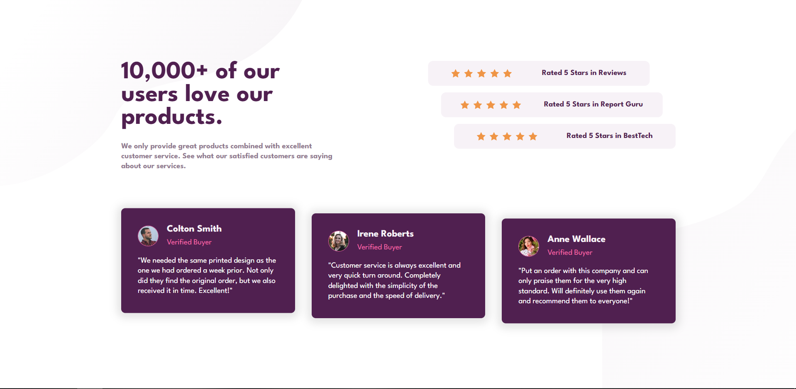

# Frontend Mentor - Social proof section solution

This is a solution to the [Social proof section challenge on Frontend Mentor](https://www.frontendmentor.io/challenges/social-proof-section-6e0qTv_bA). Frontend Mentor challenges help you improve your coding skills by building realistic projects. 

## Table of contents

- [Overview](#overview)
  - [The challenge](#the-challenge)
  - [Screenshot](#screenshot)
  - [Links](#links)
- [My process](#my-process)
  - [Built with](#built-with)
  - [What I learned](#what-i-learned)
  - [Continued development](#continued-development)
- [Author](#author)
- 

**Note: Delete this note and update the table of contents based on what sections you keep.**

## Overview

### The challenge

Users should be able to:

- View the optimal layout for the section depending on their device's screen size

### Screenshot

### Links

- Solution URL: [Add solution URL here](https://github.com/jamel123a/FrontendMentor_SocialProofSection)
- Live Site URL: [Add live site URL here](https://frontendmentor-socialproofsection2.netlify.app/)

## My process

### Built with

- Semantic HTML5 markup
- CSS custom properties
- Flexbox
- CSS Grid
- CSS Transform

### What I learned

upgrade my skill in css

### Continued development
 
 i want to be master in css 

## Author

- Frontend Mentor - [@Jamel Issaoui](https://www.frontendmentor.io/profile/jamel123a)
- Linkedin - [@Jamel Issaoui](https://www.linkedin.com/in/issaoui-jamel/)

